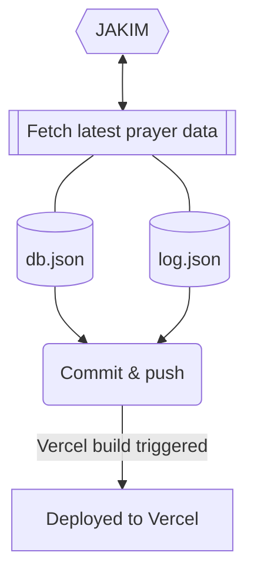

A Malaysia Prayer Time REST API server, originally build for [Malaysia Prayer Time](https://github.com/mptwaktusolat/app_waktu_solat_malaysia) app. Provide necessary data and procssing for the app features to work.

## Getting Started

First, install the dependencies:

```bash
yarn install
```

(Optional) Get the Web API key from Firebase Console. Create a `.env.local` file and add the following:

```.env
FIREBASE_PROJECT_API_KEY=AIzaXXXXXXXXXXXXXXXXXXX
```

Run the development server:

```bash
yarn dev
```

Open [http://localhost:3000](http://localhost:3000) with your browser to see the result.

The `pages/api` directory is mapped to `/api/*`. Files in this directory are treated as [API routes](https://nextjs.org/docs/api-routes/introduction) instead of React pages.

## How are the prayer time data is updated every month?

[](https://github.com/mptwaktusolat/mpt-server/actions/workflows/fetcher.yml)

The data is updated automatically every month using GitHub Action. The overall flow is depicted in the diagram below.



View the fetcher implementation [here](./fetcher).

### Deployment status

[](https://github.com/mptwaktusolat/mpt-server/actions/workflows/vercel-prod.yml)
[](https://github.com/mptwaktusolat/mpt-server/actions/workflows/vercel-preview.yml)

### API endpoints

#### Public usage

* **`GET`** `/api/solat` - Get the latest prayer time data for the current month for all location
* **`GET`** `/api/solat/{locationCode}` - Get the latest prayer time data for the current month for the given location. See all `locationCode` [here](https://mpt-server.vercel.app/locations).
* **`GET`** `/api/solat/{locationCode}/{day}` - Same as above, but you can filter for only a day (1-31)
* **`GET`** `/api/zones` - Get all the zones with Jakim code, daerah & negeri for all location.
* **`GET`** `/api/zones/{locationCode}` - Note: Only give the initial string to the location code. Eg: `kdh`, `prk`, etc. Return zones **only** for the supplied zone.
* **`GET`** `/api/mosque/{locationCode}` - Get the mosque image for the supplied location code. See all `locationCode` [here](https://mpt-server.vercel.app/locations).
* **`GET`** `api/jadual_solat` - Get monthly timetable for chosen zone in PDF

#### Internal usage (MPT App)
* **`POST`** `/api/feedback`