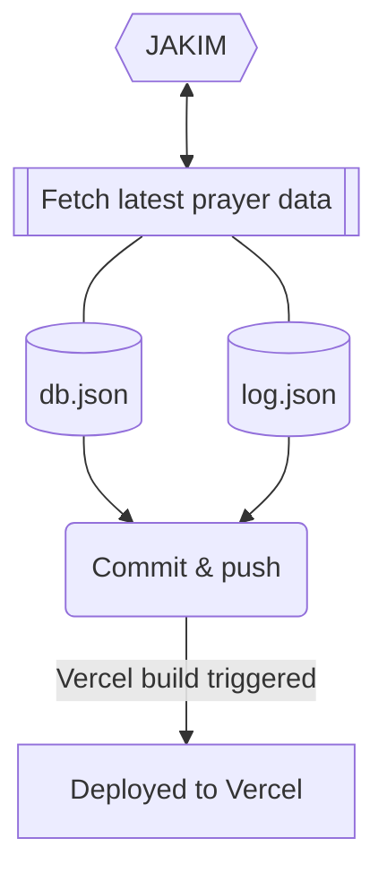

A helper server for [Malaysia Prayer Time](https://github.com/iqfareez/app_waktu_solat_malaysia) app. Provide prayer data and feedback submission endpoint.

## Getting Started

First, install the dependencies:

```bash
yarn install
```

First, run the development server:

```bash
yarn dev
```

Open [http://localhost:3000](http://localhost:3000) with your browser to see the result.

The `pages/api` directory is mapped to `/api/*`. Files in this directory are treated as [API routes](https://nextjs.org/docs/api-routes/introduction) instead of React pages.

## How are the prayer time data is updated every month?

[](https://github.com/iqfareez/mpt-server/actions/workflows/fetcher.yml)

The data is updated every month using GitHub action. The overall flow is depicted in the diagram below.



View the fetcher implementation [here](./fetcher).

### API endpoints

#### Public usage

* **`GET`** `/api/solat` - Get the latest prayer time data for the current month for all location
* **`GET`** `/api/solat/locationCode` - Get the latest prayer time data for the current month for the given location. See all `locationCode` [here](https://mpt-server.vercel.app/locations).
* **`GET`** `/api/zones` - Get all the zones with Jakim code, daerah & negeri for all location.
* **`GET`** `/api/zones/locationCode` - Note: Only give the initial string to the location code. Eg: `kdh`, `prk`, etc. Same like above but will return only for thr supplied zone.
* **`GET`** `/api/mosque/locationCode` - Get the mosque image for the supplied location code. See all `locationCode` [here](https://mpt-server.vercel.app/locations).

#### Internal usage
* **`POST`** `/api/feedback`